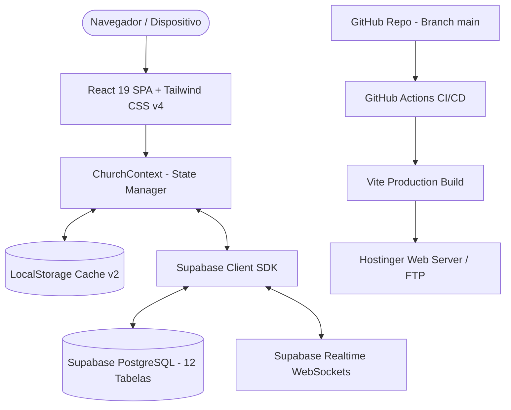

# 📚 Documentação Técnica - Sistema Eclesiástico OBPC Rio Largo

Esta documentação detalha a arquitetura técnica, fluxo de dados, estrutura de banco de dados, segurança, rotinas operacionais e pipeline de integração/entrega contínua (CI/CD) do portal e sistema de gestão da **Igreja O Brasil Para Cristo (Rio Largo - AL)**.

---

## 🏗️ 1. Arquitetura do Sistema

O sistema foi concebido segundo o padrão **Local-First com Nuvem Reativa (Hybrid Cloud-Sync)**, permitindo alta performance na renderização, disponibilidade offline e sincronização em tempo real via PostgreSQL/Supabase.



### Principais Características da Arquitetura:
1. **Zero-Latency Boot**: Ao abrir o site, a aplicação lê instantaneamente os dados armazenados em cache local (`localStorage`), exibindo a interface sem telas brancas de carregamento.
2. **Sincronização em Background**: Em segundo plano, o `ChurchContext` conecta-se ao Supabase, verifica se há atualizações remotas e sincroniza os estados sem interromper a navegação.
3. **Resiliência Offline & Fallback Permanente**: Se a conexão com a internet ou com o banco de dados cair, a aplicação continua funcionando normalmente através do armazenamento local.
4. **Gestão Dinâmica de Credenciais do Supabase**: O cliente Supabase busca chaves através de variáveis de ambiente (`VITE_SUPABASE_URL` / `VITE_SUPABASE_ANON_KEY`) e permite configuração/edição dinâmica de credenciais com persistência segura em LocalStorage (`obpc_supabase_url_v1` e `obpc_supabase_anon_key_v1`).
5. **Acesso Universal a Departamentos & Configurações**: Todos os perfis de usuários administrativos (`pastor`, `tesoureiro`, `secretaria`, `lider`) possuem acesso direto à aba de Configurações e ao módulo de criação e gestão de Departamentos & Ministérios.

---

## 🗄️ 2. Modelo de Dados e Esquema SQL (12 Tabelas)

O banco de dados relacional é estruturado em PostgreSQL no Supabase, com suporte a **Row Level Security (RLS)** e **Realtime Publication**.

### 2.1 Tabela `church_info` (Dados Institucionais e PIX)
Armazena os dados cadastrais da igreja, endereço do templo sede, contatos e chaves PIX.
```sql
CREATE TABLE IF NOT EXISTS public.church_info (
  id TEXT PRIMARY KEY DEFAULT 'main',
  name TEXT NOT NULL DEFAULT 'Igreja O Brasil Para Cristo',
  subtitle TEXT DEFAULT 'Uma Família que Ama a Deus, Serve ao Próximo e Vive a Palavra',
  pastor_name TEXT DEFAULT 'Pr. Janildo Manoel',
  vice_pastor_name TEXT DEFAULT '',
  address TEXT DEFAULT 'Loteamento 3 amigos, 3 - Forene',
  city_state TEXT DEFAULT 'Rio Largo - AL',
  zip_code TEXT DEFAULT '57100-000',
  phone TEXT DEFAULT '(82) 3214-8800',
  whatsapp TEXT DEFAULT '(82) 999694402',
  email TEXT DEFAULT 'obpcriolargo@gmail.com',
  pix_key TEXT DEFAULT '82999694402',
  pix_key_type TEXT DEFAULT 'Telefone',
  pix_recipient TEXT DEFAULT 'Igreja O Brasil Para Cristo',
  bank_name TEXT DEFAULT 'Banco Bradesco (237)',
  bank_agency TEXT DEFAULT '1452-9',
  bank_account TEXT DEFAULT '25480-1',
  youtube_channel_url TEXT DEFAULT 'https://youtube.com/@obpcriolargo',
  instagram_url TEXT DEFAULT 'https://instagram.com/obpcriolargo',
  facebook_url TEXT DEFAULT 'https://facebook.com',
  live_stream_url TEXT DEFAULT 'https://youtube.com/@obpcriolargo/live',
  history_text TEXT DEFAULT 'Fundada pelo missionário Manoel de Mello em 1956, a Igreja O Brasil Para Cristo é um ministério de fé, avivamento pentecostal, evangelização vibrante e profundo compromisso social.',
  updated_at TIMESTAMP WITH TIME ZONE DEFAULT timezone('utc'::text, now())
);
```

### 2.2 Tabela `weekly_schedules` (Cultos e Programação Semanal)
```sql
CREATE TABLE IF NOT EXISTS public.weekly_schedules (
  id TEXT PRIMARY KEY,
  day_of_week TEXT NOT NULL,
  time TEXT NOT NULL,
  title TEXT NOT NULL,
  ministry TEXT,
  description TEXT,
  leader TEXT,
  location TEXT DEFAULT 'Templo Sede',
  icon_name TEXT DEFAULT 'church',
  color_tag TEXT DEFAULT 'blue',
  order_index INTEGER DEFAULT 0,
  created_at TIMESTAMP WITH TIME ZONE DEFAULT timezone('utc'::text, now())
);
```

### 2.3 Tabela `church_events` (Eventos & Conferências)
```sql
CREATE TABLE IF NOT EXISTS public.church_events (
  id TEXT PRIMARY KEY,
  title TEXT NOT NULL,
  subtitle TEXT,
  date DATE NOT NULL,
  end_date DATE,
  time TEXT NOT NULL,
  location TEXT NOT NULL DEFAULT 'Templo Sede',
  description TEXT NOT NULL,
  banner_url TEXT,
  category TEXT NOT NULL DEFAULT 'Culto Especial',
  highlight BOOLEAN DEFAULT false,
  registration_open BOOLEAN DEFAULT true,
  registration_limit INTEGER,
  registered_count INTEGER DEFAULT 0,
  guest_speaker TEXT,
  musical_guest TEXT,
  created_at TIMESTAMP WITH TIME ZONE DEFAULT timezone('utc'::text, now())
);
```

### 2.4 Tabela `event_registrations` (Inscrições de Fiéis em Eventos)
```sql
CREATE TABLE IF NOT EXISTS public.event_registrations (
  id TEXT PRIMARY KEY,
  event_id TEXT REFERENCES public.church_events(id) ON DELETE CASCADE,
  name TEXT NOT NULL,
  phone TEXT NOT NULL,
  email TEXT,
  is_member BOOLEAN DEFAULT true,
  notes TEXT,
  registered_at TIMESTAMP WITH TIME ZONE DEFAULT timezone('utc'::text, now())
);
```

### 2.5 Tabela `church_departments` (Departamentos & Ministérios da Igreja)
Gerencia todos os ministérios oficiais e departamentais da igreja (JUBRAC, UFEBRAC, MENBRAC, UCEBRAC, ADOBRAC, Louvor, etc.).
```sql
CREATE TABLE IF NOT EXISTS public.church_departments (
  id TEXT PRIMARY KEY,
  code TEXT NOT NULL,
  name TEXT NOT NULL,
  description TEXT,
  leader TEXT,
  meeting_schedule TEXT,
  color_tag TEXT DEFAULT 'emerald',
  icon_name TEXT DEFAULT 'users',
  banner_url TEXT,
  instagram_url TEXT,
  is_active BOOLEAN DEFAULT true,
  order_index INTEGER DEFAULT 0,
  created_at TIMESTAMP WITH TIME ZONE DEFAULT timezone('utc'::text, now())
);
```

### 2.6 Tabela `media_folders` e `media_items` (Galeria de Fotos e Vídeos)
```sql
CREATE TABLE IF NOT EXISTS public.media_folders (
  id TEXT PRIMARY KEY,
  name TEXT NOT NULL,
  description TEXT,
  category TEXT NOT NULL DEFAULT 'Cultos e Celebrações',
  cover_url TEXT,
  event_date DATE,
  item_count INTEGER DEFAULT 0,
  created_at TIMESTAMP WITH TIME ZONE DEFAULT timezone('utc'::text, now())
);

CREATE TABLE IF NOT EXISTS public.media_items (
  id TEXT PRIMARY KEY,
  folder_id TEXT REFERENCES public.media_folders(id) ON DELETE CASCADE,
  title TEXT NOT NULL,
  type TEXT NOT NULL CHECK (type IN ('image', 'video')),
  url TEXT NOT NULL,
  thumbnail_url TEXT,
  description TEXT,
  date DATE DEFAULT CURRENT_DATE,
  featured BOOLEAN DEFAULT false,
  created_at TIMESTAMP WITH TIME ZONE DEFAULT timezone('utc'::text, now())
);
```

### 2.7 Tabela `prayer_requests` (Gabinete de Oração)
```sql
CREATE TABLE IF NOT EXISTS public.prayer_requests (
  id TEXT PRIMARY KEY,
  name TEXT NOT NULL,
  phone TEXT,
  is_confidential BOOLEAN DEFAULT true,
  request_type TEXT NOT NULL DEFAULT 'Família',
  message TEXT NOT NULL,
  status TEXT NOT NULL DEFAULT 'pendente' CHECK (status IN ('pendente', 'em_oracao', 'atendido')),
  pastor_notes TEXT,
  created_at TIMESTAMP WITH TIME ZONE DEFAULT timezone('utc'::text, now())
);
```

### 2.8 Tabela `church_members` (Cadastro Sigiloso de Membros)
```sql
CREATE TABLE IF NOT EXISTS public.church_members (
  id TEXT PRIMARY KEY,
  sigilo_code TEXT UNIQUE NOT NULL,
  name TEXT NOT NULL,
  phone TEXT,
  email TEXT,
  address TEXT,
  baptism_date DATE,
  ministry_role TEXT,
  is_active BOOLEAN DEFAULT true,
  joined_date DATE DEFAULT CURRENT_DATE,
  notes TEXT,
  created_at TIMESTAMP WITH TIME ZONE DEFAULT timezone('utc'::text, now())
);
```

### 2.9 Tabela `financial_transactions` (Livro Caixa & Tesouraria Sigilosa)
```sql
CREATE TABLE IF NOT EXISTS public.financial_transactions (
  id TEXT PRIMARY KEY,
  receipt_number TEXT UNIQUE NOT NULL,
  type TEXT NOT NULL CHECK (type IN ('entrada', 'saida')),
  category TEXT NOT NULL,
  amount NUMERIC(12,2) NOT NULL,
  date DATE NOT NULL DEFAULT CURRENT_DATE,
  description TEXT NOT NULL,
  payment_method TEXT NOT NULL DEFAULT 'PIX',
  member_id TEXT REFERENCES public.church_members(id) ON DELETE SET NULL,
  member_sigilo_code TEXT,
  member_name_cached TEXT,
  is_strict_confidential BOOLEAN DEFAULT true,
  registered_by TEXT NOT NULL DEFAULT 'Tesouraria',
  created_at TIMESTAMP WITH TIME ZONE DEFAULT timezone('utc'::text, now())
);
```

### 2.10 Tabela `system_users` (Usuários Administrativos)
```sql
CREATE TABLE IF NOT EXISTS public.system_users (
  id TEXT PRIMARY KEY,
  name TEXT NOT NULL,
  username TEXT UNIQUE NOT NULL,
  password TEXT NOT NULL,
  role TEXT NOT NULL DEFAULT 'pastor',
  email TEXT,
  phone TEXT,
  is_active BOOLEAN DEFAULT true,
  last_login TEXT,
  created_by TEXT DEFAULT 'Sistema',
  created_at TIMESTAMP WITH TIME ZONE DEFAULT timezone('utc'::text, now())
);
```

### 2.11 Tabela `audit_logs` (Trilha de Auditoria do Sistema)
```sql
CREATE TABLE IF NOT EXISTS public.audit_logs (
  id TEXT PRIMARY KEY,
  timestamp TEXT NOT NULL,
  user_name TEXT NOT NULL,
  user_role TEXT NOT NULL,
  action TEXT NOT NULL,
  category TEXT NOT NULL,
  details TEXT NOT NULL,
  ip_address TEXT,
  status TEXT NOT NULL DEFAULT 'sucesso',
  created_at TIMESTAMP WITH TIME ZONE DEFAULT timezone('utc'::text, now())
);
```

---

## 🔒 3. Controle de Acesso e Segurança

### 3.1 Níveis de Acesso por Função
| Perfil | Permissões |
| :--- | :--- |
| **Pastor** (`pastor`) | Acesso total e irrestrito: Gabinete Pastoral, Livro Caixa completo, Gestão de Membros, Gestão de Usuários, Mídia, Cultos, Eventos, Criação/Gestão de Departamentos, Configurações do Banco e Logs de Auditoria. |
| **Tesoureiro** (`tesoureiro`) | Acesso ao Livro Caixa, Lançamento de Entradas/Saídas, Emissão de Recibos, Relatórios Financeiros, Cadastro de Membros Contribuintes, Gestão de Departamentos e Configurações. |
| **Secretaria** (`secretaria`) | Gestão de Membros, Agenda de Cultos, Eventos, Galeria de Mídia, Pedidos de Oração, Criação/Gestão de Departamentos e Configurações. |
| **Líder** (`lider`) | Gestão de Departamentos e Ministérios, Programação Semanal de Cultos, Inscrições em Eventos, Galeria de Mídia e Acesso às Configurações do Sistema. |

> **Nota de Diretiva:** Conforme a regra do sistema, a aba de **Configurações & Banco** e o módulo de **Criação e Gestão de Departamentos** estão disponíveis para todos os usuários administrativos cadastrados.

### 3.2 Modo Sigilo Pastoral
No módulo financeiro (`AdminFinancialCRM`), o recurso **Modo Sigilo** substitui instantaneamente os nomes de membros e dizimistas pelo respectivo código anônimo (`MBR-YYYY-XXX`), permitindo que tesoureiros trabalhem em telas compartilhadas ou projetores de assembleia sem expor valores nominais a terceiros.

---

## 🚀 4. Guia de CI/CD e Deploy Contínuo

### 4.1 Estrutura do Workflow GitHub Actions (`.github/workflows/deploy.yml`)
```yaml
name: Deploy to Hostinger via FTP

on:
  push:
    branches:
      - main
  workflow_dispatch:

jobs:
  web-deploy:
    name: Build and Deploy
    runs-on: ubuntu-latest
    steps:
      - name: 📥 Checkout do Repositório
        uses: actions/checkout@v4

      - name: ⚙️ Setup do Node.js
        uses: actions/setup-node@v4
        with:
          node-version: 22
          cache: 'npm'

      - name: 📦 Instalar Dependências
        run: npm ci

      - name: 🏗️ Gerar Build de Produção
        run: npm run build
        env:
          VITE_SUPABASE_URL: ${{ secrets.VITE_SUPABASE_URL || secrets.SUPABASE_URL }}
          VITE_SUPABASE_ANON_KEY: ${{ secrets.VITE_SUPABASE_ANON_KEY || secrets.SUPABASE_ANON_KEY || secrets.SUPABASE_PUBLISHABLE_KEY }}

      - name: 🚀 Sincronizar via FTP para Hostinger
        env:
          FTP_SERVER: ${{ secrets.FTP_SERVER || secrets.FTP_HOST || vars.FTP_SERVER || vars.FTP_HOST }}
          FTP_USERNAME: ${{ secrets.FTP_USERNAME || secrets.FTP_USER || vars.FTP_USERNAME || vars.FTP_USER }}
          FTP_PASSWORD: ${{ secrets.FTP_PASSWORD || secrets.FTP_PASS || vars.FTP_PASSWORD || vars.FTP_PASS }}
          FTP_REMOTE_DIR: './'
        run: node deploy-ftp.js
```

### 4.2 Script de Transferência FTP (`deploy-ftp.js`)
O script utiliza a biblioteca `basic-ftp` para realizar sincronização com proteção TLS (`explicit: true` e fallback para não criptografado se necessário), enviando os arquivos da pasta `dist/` diretamente para o diretório raiz `./` do servidor da Hostinger.

---

## 🛠️ 5. Guia de Manutenção e Operação

### 5.1 Como Gerar Backup Manual
No painel administrativo, acesse a aba **Configurações & Banco** e clique no botão **Backup JSON**. O sistema fará o download instantâneo de um snapshot completo com todas as 12 tabelas em formato JSON estruturado.

### 5.2 Como Testar e Configurar Credenciais do Supabase
1. No painel administrativo, vá em **Configurações & Banco**.
2. Na seção **"Credenciais do Projeto Supabase"**, visualize ou altere a **URL da API** e a **Anon Key**.
3. Clique em **"Salvar & Conectar Supabase"** para validar e persistir a conexão.
4. Para retornar às configurações originais de fábrica do arquivo `.env`, clique em **"Restaurar Padrão do Sistema"**.
5. Clique em **"Testar Conexão"** para validar a comunicação em tempo real com o PostgreSQL.

### 5.3 Como Fazer Sincronização Forçada (Push / Pull)
- **Push (Local > Supabase)**: Envia todos os cultos, eventos, departamentos, membros, mídias, pedidos de oração e livro caixa locais para o Supabase PostgreSQL.
- **Pull (Supabase > Local)**: Puxa todos os dados atualizados do banco em nuvem Supabase e atualiza o estado deste navegador.

---

## 📞 Suporte Técnico e Desenvolvimento
- **Empresa**: [Maximo Sistemas](https://maximosistemas.com)
- **E-mail**: `obpcriolargo@gmail.com`
- **Endereço Sede**: Loteamento 3 amigos, 3 - Forene, Rio Largo - AL

