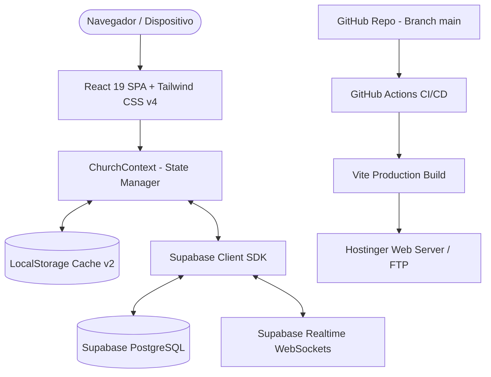

# 📚 Documentação Técnica - Sistema Eclesiástico OBPC Rio Largo

Esta documentação detalha a arquitetura técnica, fluxo de dados, estrutura de banco de dados, segurança, rotinas operacionais e pipeline de integração/entrega contínua (CI/CD) do portal e sistema de gestão da **Igreja O Brasil Para Cristo (Rio Largo - AL)**.

---

## 🏗️ 1. Arquitetura do Sistema

O sistema foi concebido segundo o padrão **Local-First com Nuvem Reativa (Hybrid Cloud-Sync)**, permitindo alta performance na renderização, disponibilidade offline e sincronização em tempo real via PostgreSQL/Supabase.



### Principais Características da Arquitetura:
1. **Zero-Latency Boot**: Ao abrir o site, a aplicação lê instantaneamente os dados armazenados em cache local (`localStorage`), exibindo a interface sem telas brancas de carregamento.
2. **Sincronização em Background**: Em segundo plano, o `ChurchContext` conecta-se ao Supabase, verifica se há atualizações remotas e sincroniza os estados sem interromper a navegação.
3. **Resiliência Offline**: Se a conexão com a internet ou com o banco de dados cair, a aplicação continua funcionando normalmente através do armazenamento local.
4. **Fallback Inteligente de Credenciais**: O cliente Supabase busca chaves através de variáveis de ambiente (`VITE_SUPABASE_URL` / `VITE_SUPABASE_ANON_KEY`) e permite credenciais dinâmicas salvas na aplicação caso necessário.

---

## 🗄️ 2. Modelo de Dados e Esquema SQL

O banco de dados relacional é estruturado em PostgreSQL no Supabase, com suporte a **Row Level Security (RLS)** e **Realtime Publication**.

### 2.1 Tabela `church_info` (Dados Institucionais e PIX)
Armazena os dados cadastrais da igreja, endereço do templo sede, contatos e chaves PIX.
```sql
CREATE TABLE IF NOT EXISTS public.church_info (
  id TEXT PRIMARY KEY DEFAULT 'main',
  name TEXT NOT NULL DEFAULT 'Igreja O Brasil Para Cristo',
  subtitle TEXT DEFAULT 'Uma Família que Ama a Deus, Serve ao Próximo e Vive a Palavra',
  pastor_name TEXT DEFAULT 'Pr. Janildo Manoel',
  vice_pastor_name TEXT DEFAULT '',
  address TEXT DEFAULT 'Loteamento 3 amigos, 3 - Forene',
  city_state TEXT DEFAULT 'Rio Largo - AL',
  zip_code TEXT DEFAULT '57100-000',
  phone TEXT DEFAULT '(82) 3214-8800',
  whatsapp TEXT DEFAULT '(82) 999694402',
  email TEXT DEFAULT 'obpcriolargo@gmail.com',
  pix_key TEXT DEFAULT '82999694402',
  pix_key_type TEXT DEFAULT 'Telefone',
  pix_recipient TEXT DEFAULT 'Igreja O Brasil Para Cristo',
  bank_name TEXT DEFAULT 'Mercado Pago',
  bank_agency TEXT DEFAULT '',
  bank_account TEXT DEFAULT '',
  youtube_channel_url TEXT DEFAULT 'https://youtube.com/@obpcriolargo',
  instagram_url TEXT DEFAULT 'https://instagram.com/obpcriolargo',
  facebook_url TEXT DEFAULT 'https://facebook.com',
  live_stream_url TEXT DEFAULT 'https://youtube.com/@obpcriolargo/live',
  history_text TEXT DEFAULT '',
  updated_at TIMESTAMP WITH TIME ZONE DEFAULT timezone('utc'::text, now())
);
```

### 2.2 Tabela `church_schedules` (Cultos e Programação)
```sql
CREATE TABLE IF NOT EXISTS public.church_schedules (
  id TEXT PRIMARY KEY,
  day_of_week TEXT NOT NULL,
  title TEXT NOT NULL,
  time TEXT NOT NULL,
  description TEXT,
  target_audience TEXT,
  leader_name TEXT,
  banner_color TEXT,
  is_active BOOLEAN DEFAULT true,
  created_at TIMESTAMP WITH TIME ZONE DEFAULT timezone('utc'::text, now())
);
```

### 2.3 Tabela `church_events` (Eventos & Congressos)
```sql
CREATE TABLE IF NOT EXISTS public.church_events (
  id TEXT PRIMARY KEY,
  title TEXT NOT NULL,
  description TEXT,
  date TEXT NOT NULL,
  time TEXT NOT NULL,
  location TEXT NOT NULL,
  banner_url TEXT,
  category TEXT DEFAULT 'geral',
  is_highlight BOOLEAN DEFAULT false,
  requires_registration BOOLEAN DEFAULT false,
  max_attendees INTEGER,
  current_attendees INTEGER DEFAULT 0,
  registered_members JSONB DEFAULT '[]'::jsonb,
  created_at TIMESTAMP WITH TIME ZONE DEFAULT timezone('utc'::text, now())
);
```

### 2.4 Tabela `media_folders` e `media_items` (Galeria de Mídia)
```sql
CREATE TABLE IF NOT EXISTS public.media_folders (
  id TEXT PRIMARY KEY,
  name TEXT NOT NULL,
  description TEXT,
  created_at TIMESTAMP WITH TIME ZONE DEFAULT timezone('utc'::text, now())
);

CREATE TABLE IF NOT EXISTS public.media_items (
  id TEXT PRIMARY KEY,
  folder_id TEXT REFERENCES public.media_folders(id) ON DELETE SET NULL,
  title TEXT NOT NULL,
  type TEXT NOT NULL CHECK (type IN ('image', 'video')),
  url TEXT NOT NULL,
  thumbnail_url TEXT,
  date TEXT NOT NULL,
  description TEXT,
  is_highlight BOOLEAN DEFAULT false,
  created_at TIMESTAMP WITH TIME ZONE DEFAULT timezone('utc'::text, now())
);
```

### 2.5 Tabela `prayer_requests` (Gabinete de Oração)
```sql
CREATE TABLE IF NOT EXISTS public.prayer_requests (
  id TEXT PRIMARY KEY,
  name TEXT NOT NULL,
  phone TEXT,
  is_confidential BOOLEAN DEFAULT false,
  request_type TEXT NOT NULL,
  message TEXT NOT NULL,
  status TEXT DEFAULT 'pendente' CHECK (status IN ('pendente', 'em_oracao', 'atendido')),
  pastor_notes TEXT,
  created_at TIMESTAMP WITH TIME ZONE DEFAULT timezone('utc'::text, now())
);
```

### 2.6 Tabela `church_members` (Cadastro Sigiloso de Membros)
```sql
CREATE TABLE IF NOT EXISTS public.church_members (
  id TEXT PRIMARY KEY,
  sigilo_code TEXT NOT NULL UNIQUE,
  name TEXT NOT NULL,
  phone TEXT,
  email TEXT,
  address TEXT,
  baptism_date TEXT,
  ministry_role TEXT,
  is_active BOOLEAN DEFAULT true,
  joined_date TEXT NOT NULL,
  notes TEXT,
  created_at TIMESTAMP WITH TIME ZONE DEFAULT timezone('utc'::text, now())
);
```

### 2.7 Tabela `financial_transactions` (Livro Caixa & Tesouraria)
```sql
CREATE TABLE IF NOT EXISTS public.financial_transactions (
  id TEXT PRIMARY KEY,
  receipt_number TEXT NOT NULL UNIQUE,
  type TEXT NOT NULL CHECK (type IN ('entrada', 'saida')),
  category TEXT NOT NULL,
  amount NUMERIC(12, 2) NOT NULL,
  date TEXT NOT NULL,
  description TEXT NOT NULL,
  payment_method TEXT NOT NULL,
  member_id TEXT REFERENCES public.church_members(id) ON DELETE SET NULL,
  member_name_cached TEXT,
  registered_by TEXT NOT NULL,
  created_at TIMESTAMP WITH TIME ZONE DEFAULT timezone('utc'::text, now())
);
```

### 2.8 Tabela `system_users` (Usuários Administrativos)
```sql
CREATE TABLE IF NOT EXISTS public.system_users (
  id TEXT PRIMARY KEY,
  username TEXT NOT NULL UNIQUE,
  name TEXT NOT NULL,
  role TEXT NOT NULL CHECK (role IN ('pastor', 'tesoureiro', 'secretaria', 'lideranca')),
  password TEXT NOT NULL,
  is_active BOOLEAN DEFAULT true,
  last_login TEXT,
  created_at TIMESTAMP WITH TIME ZONE DEFAULT timezone('utc'::text, now())
);
```

### 2.9 Tabela `audit_logs` (Trilha de Auditoria)
```sql
CREATE TABLE IF NOT EXISTS public.audit_logs (
  id TEXT PRIMARY KEY,
  action TEXT NOT NULL,
  category TEXT NOT NULL,
  details TEXT NOT NULL,
  user_name TEXT NOT NULL,
  user_role TEXT NOT NULL,
  ip_address TEXT,
  severity TEXT DEFAULT 'info' CHECK (severity IN ('info', 'aviso', 'erro', 'critico')),
  created_at TIMESTAMP WITH TIME ZONE DEFAULT timezone('utc'::text, now())
);
```

---

## 🔒 3. Controle de Acesso e Segurança

### 3.1 Níveis de Acesso por Função
| Perfil | Permissões |
| :--- | :--- |
| **Pastor** (`pastor`) | Acesso total irrestrito: Gabinete Pastoral, Livro Caixa completo, Gestão de Membros, Gestão de Usuários, Mídia, Cultos, Eventos, Configurações do Banco e Logs de Auditoria. |
| **Tesoureiro** (`tesoureiro`) | Acesso ao Livro Caixa, Lançamento de Entradas/Saídas, Emissão de Recibos, Relatórios Financeiros e Cadastro de Membros Contribuintes. |
| **Secretaria** (`secretaria`) | Gestão de Membros, Agenda de Cultos, Eventos, Galeria de Mídia e Pedidos de Oração. |
| **Liderança** (`lideranca`) | Visualização de Programação, Inscrições em Eventos e envio de materiais para a galeria. |

### 3.2 Modo Sigilo Pastoral
No módulo financeiro (`AdminFinancialCRM`), o recurso **Modo Sigilo** substitui instantaneamente os nomes de membros e dizimistas pelo respectivo código anônimo (`MBR-YYYY-XXX`), permitindo que tesoureiros trabalhem em telas compartilhadas ou projetores de assembleia sem expor valores nominais a terceiros.

---

## 🚀 4. Guia de CI/CD e Deploy Contínuo

### 4.1 Estrutura do Workflow GitHub Actions (`.github/workflows/deploy.yml`)
```yaml
name: Deploy to Hostinger via FTP

on:
  push:
    branches:
      - main
  workflow_dispatch:

jobs:
  web-deploy:
    name: Build and Deploy
    runs-on: ubuntu-latest
    steps:
      - name: 📥 Checkout do Repositório
        uses: actions/checkout@v4

      - name: ⚙️ Setup do Node.js
        uses: actions/setup-node@v4
        with:
          node-version: 22
          cache: 'npm'

      - name: 📦 Instalar Dependências
        run: npm ci

      - name: 🏗️ Gerar Build de Produção
        run: npm run build
        env:
          VITE_SUPABASE_URL: ${{ secrets.VITE_SUPABASE_URL || secrets.SUPABASE_URL }}
          VITE_SUPABASE_ANON_KEY: ${{ secrets.VITE_SUPABASE_ANON_KEY || secrets.SUPABASE_ANON_KEY || secrets.SUPABASE_PUBLISHABLE_KEY }}

      - name: 🚀 Sincronizar via FTP para Hostinger
        env:
          FTP_SERVER: ${{ secrets.FTP_SERVER || secrets.FTP_HOST || vars.FTP_SERVER || vars.FTP_HOST }}
          FTP_USERNAME: ${{ secrets.FTP_USERNAME || secrets.FTP_USER || vars.FTP_USERNAME || vars.FTP_USER }}
          FTP_PASSWORD: ${{ secrets.FTP_PASSWORD || secrets.FTP_PASS || vars.FTP_PASSWORD || vars.FTP_PASS }}
          FTP_REMOTE_DIR: './'
        run: node deploy-ftp.js
```

### 4.2 Script de Transferência FTP (`deploy-ftp.js`)
O script utiliza a biblioteca `basic-ftp` para realizar sincronização com proteção TLS (`explicit: true` e fallback para não criptografado se necessário), enviando os arquivos da pasta `dist/` diretamente para o diretório raiz `./` do servidor da Hostinger.

---

## 🛠️ 5. Guia de Manutenção e Operação

### 5.1 Como Gerar Backup Manual
No painel administrativo, acesse a aba **Supabase & Banco** e clique no botão **Backup JSON**. O sistema fará o download instantâneo de um snapshot completo com todas as tabelas em formato JSON estruturado.

### 5.2 Como Testar a Conexão com o Supabase
No painel administrativo, vá em **Supabase & Banco** e clique em **Testar Conexão**. O sistema fará uma consulta de integridade à tabela `church_info` e exibirá o status em tempo real.

### 5.3 Como Fazer Sincronização Forçada (Push / Pull)
- **Push (Local > Supabase)**: Envia todos os dados armazenados no navegador para sobrescrever/popular o Supabase.
- **Pull (Supabase > Local)**: Puxa todos os dados do Supabase e substitui os dados locais do navegador.

---

## 📞 Suporte Técnico e Desenvolvimento
- **Empresa**: [Maximo Sistemas](https://maximosistemas.com)
- **E-mail**: `obpcriolargo@gmail.com`
- **Endereço Sede**: Loteamento 3 amigos, 3 - Forene, Rio Largo - AL
